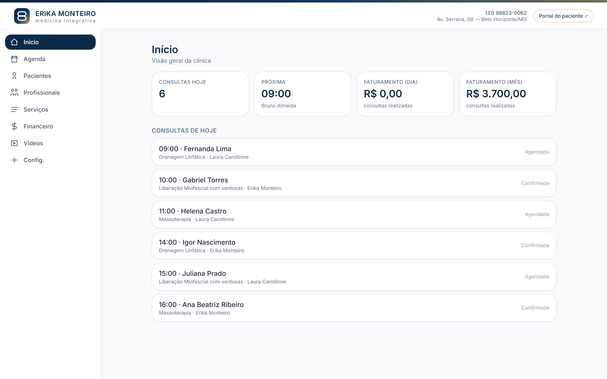
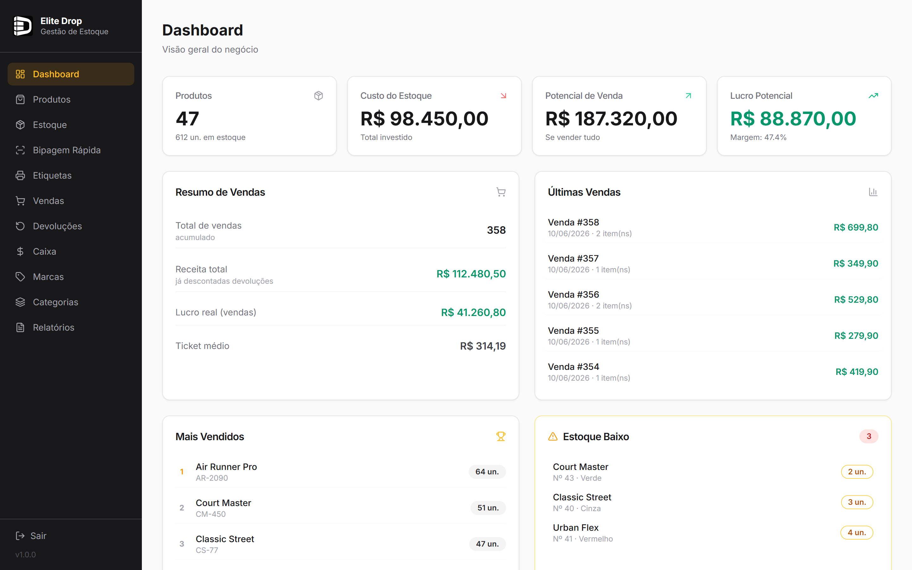

# 👋 Guilherme Souza — Desenvolvimento de Sistemas e Sites

> **Transformo a sua ideia em um sistema que funciona.**

Sou desenvolvedor Full Stack em Belo Horizonte/MG, com **formação superior na área de tecnologia** e **pós-graduação em Engenharia de Software + IA em andamento**. Crio **sites, sistemas de gestão, APIs e automações sob medida** para empresas e negócios de todos os tamanhos — com a mesma engenharia que aplico em projetos corporativos de grande porte.

🔗 **[Veja o portfólio completo (site)](https://guisouzals.github.io/portfolio/)**

---

## 🚀 O que eu faço

| Serviço | Para quem |
|---|---|
| 🖥️ **Sistemas sob medida** | Estoque, vendas, agendamento, financeiro — do seu jeito |
| 🌐 **Sites e landing pages** | Presença profissional que converte visitante em cliente |
| 🔌 **APIs e integrações** | Pagamento, nota fiscal, WhatsApp, planilhas — tudo conectado |
| ⚙️ **Automação de processos** | Tarefas manuais viram processos automáticos |

## 💼 Projetos em destaque

### 🏥 Sistema de gestão para clínica
Plataforma completa para clínica de medicina integrativa: agenda de consultas, pacientes, financeiro e portal exclusivo do paciente.

`Next.js` `React` `TypeScript` `Tailwind CSS`

### 👟 Elite Drop — Gestão de loja de calçados
Sistema de gestão para loja de tênis: dashboard com lucro e estoque baixo, **leitura de código de barras pela câmera**, vendas, devoluções e caixa.

`Next.js` `PostgreSQL` `Prisma` `Cloudinary`

> *Capturas com dados fictícios de demonstração — nenhuma informação real de clientes é exposta.*

## 🏗️ Experiência em projetos de grande porte

Atuo profissionalmente em sistemas críticos (detalhes preservados por confidencialidade/LGPD):

- **Plataforma de mensageria e campanhas em larga escala** — empresa de tecnologia · Java 21, Spring Boot 3, React, Elasticsearch
- **Hub de integração do setor automotivo** — empresa de tecnologia · Java, Spring Cloud, Angular, .NET
- **Sistema educacional de órgão público de MG** — Vue 3, microsserviços Java, Spring Cloud Gateway, JWT

## 🛠️ Stack

## 📫 Vamos conversar?

- 💬 **WhatsApp:** [(31) 98480-0111](https://wa.me/5531984800111)
- ✉️ **E-mail:** [guigui092808@gmail.com](mailto:guigui092808@gmail.com)
- 💼 **LinkedIn:** [guilherme-souza](https://www.linkedin.com/in/guilherme-souza-2a905a177/)
